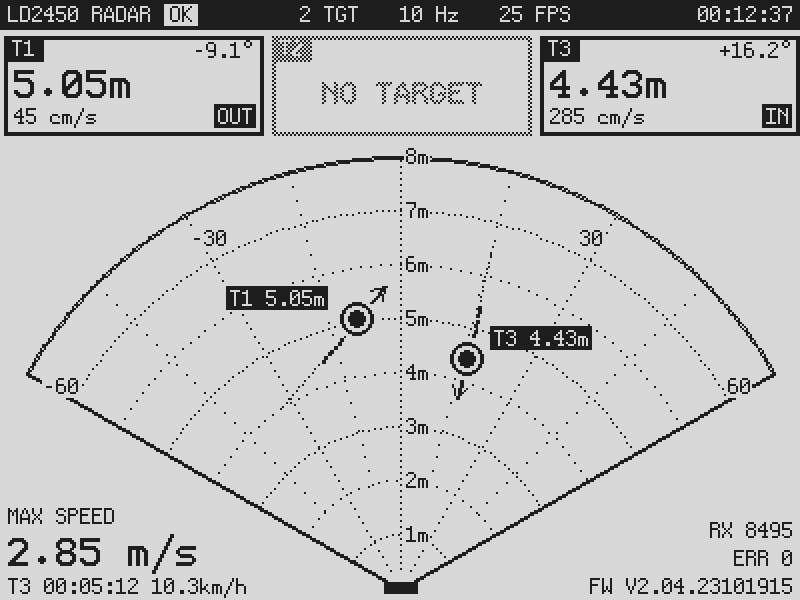

# LD2450-RLCD-Radar

HLK-LD2450 24 GHz radar display for the Waveshare ESP32-S3-RLCD-4.2 (400×300 reflective LCD).



*Host-rendered preview of the real `radar_ui.cpp` with synthetic targets.*

## Demo

Watch on YouTube: <https://www.youtube.com/shorts/R_z7cVuc3Cc>

## Wiring

| LD2450 | RLCD-4.2 header | GPIO |
|---|---|---|
| 5V  | `VBUS` | — |
| GND | `GND`  | — |
| TX  | `RXD`  | 44 |
| RX  | `TXD`  | 43 |

UART 256000 8N1. `VBUS` is present only on USB power. On the 18650 alone the sensor needs
its own 5 V (a boost module from `3V3`/battery), since the LD2450 wants 5 V.

At reset the ROM prints its boot log on GPIO43 (the sensor's RX). The sensor ignores bytes
that are not framed commands. If that ever becomes a problem, move the pins to GP1/GP2 in
`include/radar.h`.

## Screen

- **Status bar:** link state (`WAIT` / `OK` / `NO DATA`), target count, sensor report
  rate (Hz), screen FPS, session uptime.
- **Cards T1–T3:** distance, azimuth, radial speed, `IN`/`OUT`. A card with no target is
  drawn at 50 % (checkerboard dither).
- **Radar:** ±60°, rings 1–8 m. Each target has a marker, a label, a heading arrow (length
  scales with speed) and a trail. Dots glide between the sensor's ~10 Hz reports.
- **Bottom left:** the fastest |radial speed| seen this session, which target it was and
  when. **KEY** resets it.
- **Bottom right:** frames received, framing errors, LD2450 firmware version.

## 3D printing

[`3DPrinting/rlcd_ld2450_bracket.stl`](3DPrinting/rlcd_ld2450_bracket.stl) is a bracket that holds
the LD2450 on the RLCD-4.2. The model is not ours: it comes from
[ThatProject](https://www.youtube.com/@ThatProject), and all credit goes to that author.

## Build

```sh
pio run -t upload -t monitor
```

If targets move the wrong way left/right for how you mounted the sensor, set
`RADAR_MIRROR_X 1` in `include/radar.h`. If the image is upside down, use `U8G2_R3`
in `src/radar_ui.cpp`.

## Photos

<p align="center">
  
  
</p>


## License

[MIT](LICENSE) for the firmware. The STL in `3DPrinting/` is by
[ThatProject](https://www.youtube.com/@ThatProject) and is not covered by this license.
